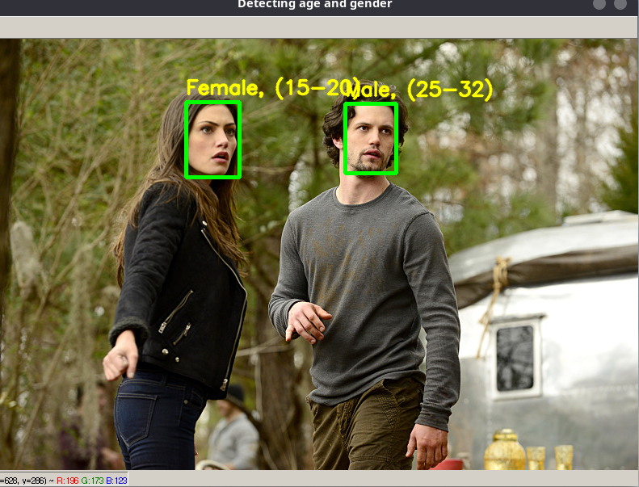
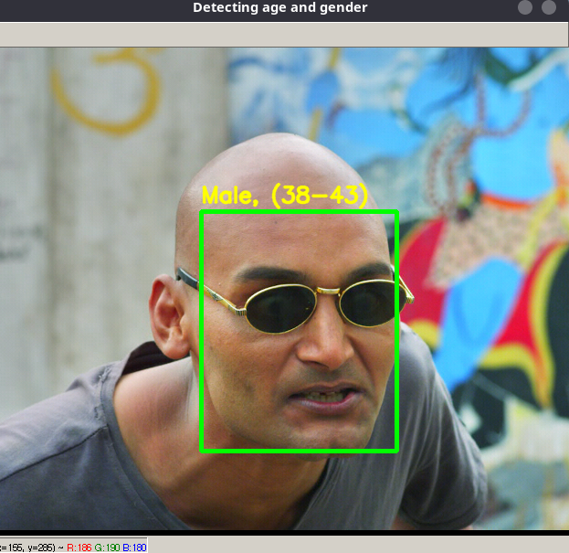
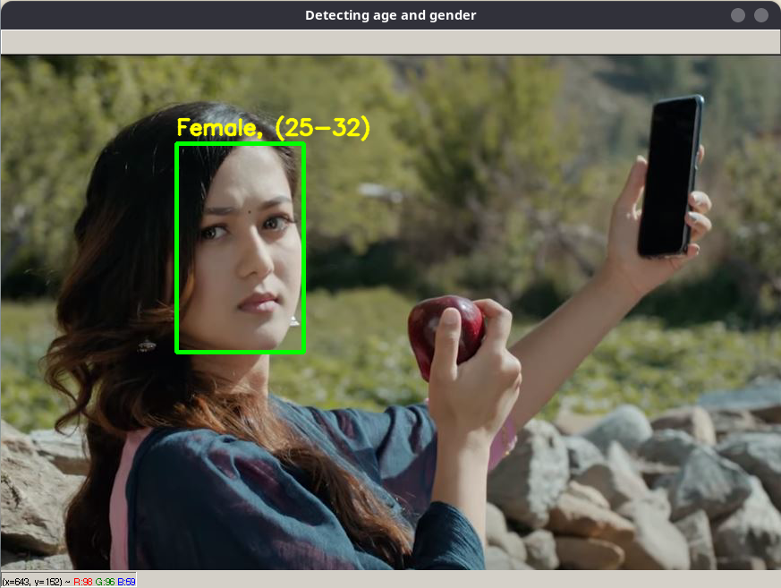

# Age gender detection
The predicted gender may be one of ‘Male’ and ‘Female’, and the predicted age may be one of the following ranges- (0 – 2), (4 – 6), (8 – 12), (15 – 20), (25 – 32), (38 – 43), (48 – 53), (60 – 100) 

<h3> The dataset is taken from </h3>
https://www.kaggle.com/ttungl/adience-benchmark-gender-and-age-classification

<h2>Test case 1 </h2>

<h2>Test case 2 </h2>

<h2>Test case 3 </h2>

